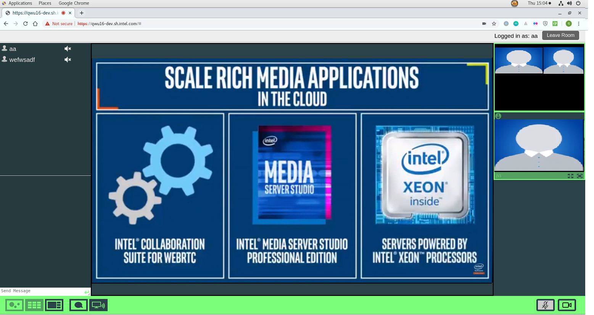

The Video Conferencing Sample implements a web service demo for OWT(Open WebRTC Toolkit) media server, which fully demonstrates OWT features in mix and forward modes. It also provides basic conferencing actions like share screen, instant messaging, mute/unmute audio and video in web UI.



### Install docker engine:        

(1) Install [docker engine](https://docs.docker.com/install).     
(2) Install [docker compose](https://docs.docker.com/compose/install), if you plan to deploy through docker compose. Version 1.20+ is required.    
(3) Setup [docker swarm](https://docs.docker.com/engine/swarm), if you plan to deploy through docker swarm. See [docker swarm setup](deployment/docker-swarm/README.md) for additional setup details.    

### Setup docker proxy:

```bash
(4) sudo mkdir -p /etc/systemd/system/docker.service.d       
(5) printf "[Service]\nEnvironment=\"HTTPS_PROXY=$https_proxy\" \"NO_PROXY=$no_proxy\"\n" | sudo tee /etc/systemd/system/docker.service.d/proxy.conf       
(6) sudo systemctl daemon-reload          
(7) sudo systemctl restart docker     
```

### Build docker images: 

```bash
(1) mkdir build    
(2) cd build     
(3) cmake ..    
(4) make     
```

### Start/stop services:

Use the following commands to start/stop services via docker swarm:    
```bash
(1) make start_docker_swarm      
(2) make stop_docker_swarm      
```


### Launch browser:

Launch your browser and point to `https://localhost` to join the video conference. Note that the default certificates are self-signed with limited lifetime for demo purpose only. Suggest to replace them with your own key pairs with trusted certificates. You may need to confirm the self-signed certificate exception to continue if default certificates are used for demo purpose.  
